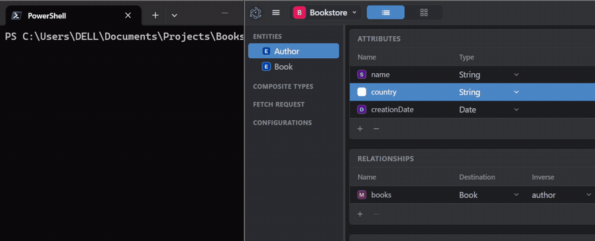
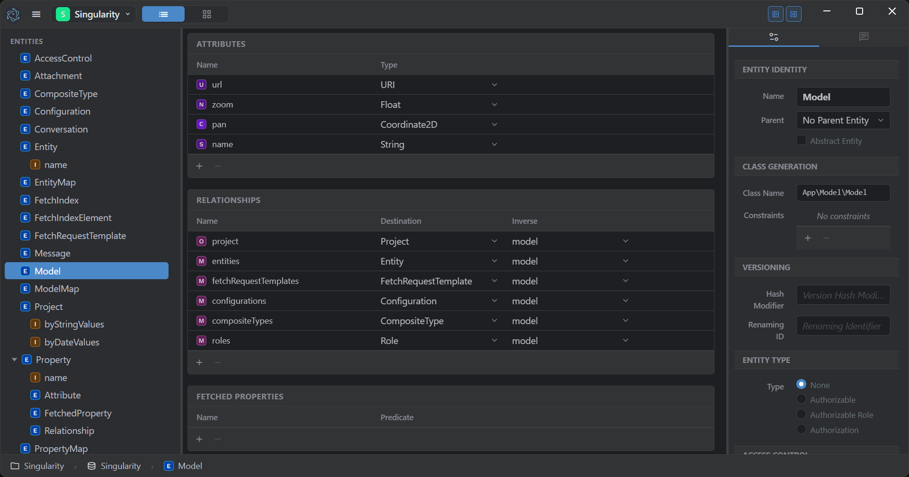
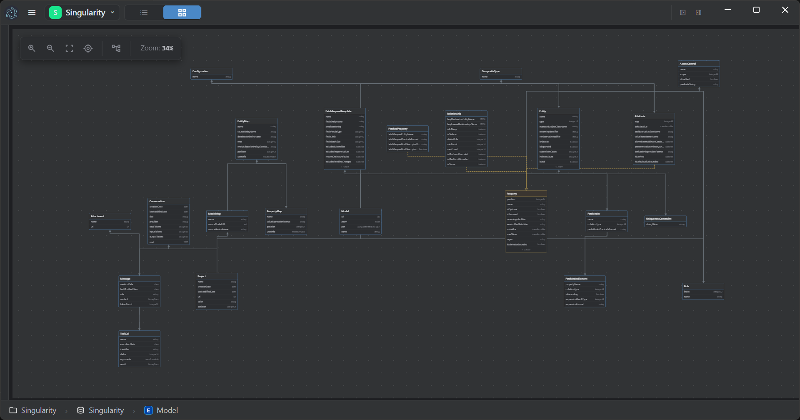

# Singularity

**The authoring environment of the Sabatier stack.**



An attribute renamed in the editor, saved, and read back over HTTP under its new
name with the values still in place. One take, no cut: there was no migration
step in between.

You declare routes and controllers in every project you build. They can — and should — be inferred, because they are always the same. And when you later want to expose that same data to an agent, you declare all of it again, permissions included.

Singularity is where you stop doing that. Design the data model — in a visual editor, or by describing it to an agent over MCP — and the application that backs it already exists:

- a **REST API** for every entity, with filtering, sorting, pagination and aggregates
- an **MCP tool catalogue** for LLM agents, derived from the same model
- **field-level security and ownership** enforced identically on both
- **schema and data migrated** when the model changes

Nor do you write the project around it. Creating one generates the whole bundle — `Info.plist`, `composer.json`, HTTP and CLI entry points, the application delegate, the `.mom` model, and a `.env` already carrying the database settings and, if you asked for JWT, a freshly generated signing key. The managed-object subclasses are generated from the model on demand, from the editor or over MCP.

No route, no controller, no serializer, no tool definition, no migration file, no bootstrap. One declaration, every surface.

Singularity is itself one of those applications: **it was modeled in its own editor**, its data model saved as [`Resources/Singularity.mom`](Resources/Singularity.mom), and the classes in [`src/Model/`](src/Model/) generated from that model. Its own directory layout is exactly what it scaffolds for a new project. So the ceiling is not a CRUD app — it is this IDE, copilot included.

---

## The editor



That claim, on screen: this is Singularity's own model open in its own editor, on the entity named `Model`. Every relationship carries its inverse, and the inspector on the right is where an entity declares the class it generates, how it versions, and who may read it.



The same model as a graph. Layouts are draggable and persisted with the project.


---

## What that looks like

Model two entities — `Author` and `Book`, one relationship between them — and generate the project. Nothing else is written. This is the whole of its `src/`:

```
src/
└── Delegate.php
```

The entities are already served:

```bash
curl -X POST http://127.0.0.1:8001/Author \
  -H "Content-Type: application/json" \
  -d '{"name":"Ursula K. Le Guin","country":"US"}'
```

```json
{"objectID":1,"entityName":"Author","name":"Ursula K. Le Guin","country":"US","creationDate":"2026-09-22 11:21:45"}
```

`201 Created`. The `creationDate` was neither sent nor defaulted by hand: an attribute the model declares non-optional never arrives null, so a date becomes the current time and a UUID is generated. The model states the guarantee and the object keeps it.

Relate a new object to one that already exists by naming it — an `objectID` and at least one attribute:

```bash
curl -X POST http://127.0.0.1:8001/Book \
  -H "Content-Type: application/json" \
  -d '{"title":"The Left Hand of Darkness","isbn":"9780441478125","author":{"objectID":1,"name":"Ursula K. Le Guin"}}'
```

And ask for the shape you want back, rather than the one an endpoint decided for you:

```bash
curl http://127.0.0.1:8001/Book \
  -H 'Serialization: {"title":true,"isbn":true,"author":{"name":true,"country":true}}'
```

```json
[{"objectID":1,"entityName":"Book","title":"The Left Hand of Darkness","isbn":"9780441478125",
  "author":{"objectID":1,"entityName":"Author","name":"Ursula K. Le Guin","country":"US"}}]
```

`objectID` and `entityName` come back at every level whether or not the
projection asks for them: they are what identifies a row, and a response that
omits them cannot be used to update one.

The same model answers an MCP client: `describe_model` returns the entities with their attributes and relationships, and `fetch` returns the rows above. No tool definitions were written either.

Then rename `country` to `nationality` in the editor and save. The next request returns the new name with the values still in place — no migration file, no migration step.


---

## What Singularity Proves

Every app generated by Singularity is, by definition, a **Service** application running on **CoreData**, grounded in **Foundation**. The point is not merely to generate files, but to **lock the architecture in**:

- **Foundation** provides the object model, collections, KVC/KVO, and system primitives.
- **CoreData** provides the managed object graph, identity, faulting, and persistence.
- **Service** provides the runtime, responder pipeline, and view lifecycle.

Most frameworks treat persistence as plumbing and state as transient. Singularity treats the model as the **center of gravity**, so the rest of the system can be honest: objects keep their identity, changes are tracked rather than inferred, the lifecycle is explicit, and an entity is reachable over HTTP and MCP the moment it exists in the model — no wiring, no migration scripts. Create a project, model your system, save, and CoreData migrates structure and data automatically.

---

## From no-code API to full-stack app

What you generate is a **Sabatier Service** backend, and how much code you write on top of it is entirely up to you. The same design tool spans the whole range:

- **A working API with no code.** Once you model your entities and generate the project, Sabatier Service already answers HTTP requests for them — listing, filtering, counting, creating, updating, and deleting records — with field-level access control and ownership enforcement applied automatically from the model. You don't write a single endpoint to get a usable REST API out of your design.
- **A backend with real business logic.** When the built-in behavior isn't enough, add your own responders, domain services, and importers alongside the generated code. The generated model and subclasses stay the foundation; your logic lives on top.
- **A full-stack application with any frontend.** The backend exposes a clear HTTP contract — managed objects and a serialization convention — so the frontend is free. Use Singularity's own frontend approach (Vite + TypeScript + Latte, as this app does), or a framework like Vue, React, or anything that speaks HTTP. The backend doesn't dictate the frontend.

Singularity itself sits at the far end of that range: a full application built on its own generated backend. One generator, the whole spectrum.

---

## Features

- **Visual model editor** — design entities, attributes, relationships, fetched properties, fetch indexes, uniqueness constraints, fetch request templates, configurations, composite types, and access control roles.
- **Two ways to see the model** — a table/inspector view and an interactive entity-relationship **graph view** (Cytoscape) with draggable, persisted layouts.
- **AI copilot** — an in-editor chat that edits the model for you. Multi-provider (Anthropic and others), image attachments, MCP tool calls against the live model, persisted conversations, and token accounting.
- **Project scaffolding** — create a full web-service project from scratch, with optional security headers, CORS, and JWT auth generated in.
- **Code generation** — generate managed object subclasses and project files on demand from your model.
- **SQL schema viewer & export** — inspect the generated schema and export the database, optionally including data and comments.
- **Live persistence** — saving migrates the underlying `.mom` model and data automatically; no CLI ceremony, no hand-written migrations.
- **Desktop app** — an Electron wrapper with native dialogs for opening projects, choosing directories, and revealing files.

---

## Requirements

- **PHP 8.5+** with extensions: `json`, `gettext`, `intl`, `redis`
- **MariaDB** — the store Singularity's own model lives in
- **Redis** on `127.0.0.1` (default port)
- **Apache** with `mod_rewrite`, serving the project from the document root (routing is handled by `.htaccess`). On a vhost, also set `Options -MultiViews`.
- **Node.js** (for the Vite frontend build)
- The three sibling Sabatier packages checked out next to this repo: `../Foundation`, `../CoreData`, `../Service`

The PHP backend is served at `http://localhost:8001/`.

---

## Getting Started

### Configuration

Copy the two example files and fill in what your installation needs:

```bash
cp .env.example .env
cp .htaccess.example .htaccess
```

`.env` carries the database name, host and credentials; [`.env.example`](.env.example) documents every variable with its default. The database itself does not need to exist yet: CoreData creates the schema named in `SQL_SCHEMA_NAME` on first run, along with its tables, constraints and correlation tables. The credentials you supply must be allowed to create it.

### PHP backend
```bash
composer install
```

### Frontend (Vite + TypeScript)
```bash
npm install
npm run dev          # Vite dev server on port 5173 (hot reload)
npm run build        # production build to Build/
```

For hot-reload during development, set `VITE_DEV_SERVER=http://127.0.0.1:5173` in `.env`. Without it, assets are loaded from the production build via `Build/.vite/manifest.json`.

### Electron desktop app
```bash
cd Electron
npm install
npm start            # electron-forge dev mode
npm run make         # package for distribution
```

Electron does not serve the app — it wraps the running PHP server in a native window.

---

## Architecture

Singularity is a **Service** application. Routing is attribute-based: the framework reflects on PHP attributes to build routes, so defining a controller *is* defining a route. Views are server-rendered with **Latte** and hydrated by a Vite/TypeScript frontend.

The object graph mirrors the domain it edits — because it *is* the domain it edits. The managed objects in `src/Model/` were designed as entities in Singularity's own editor, then generated:

```
Project → Model → Entity → Attribute / Relationship / FetchedProperty
Entity  also groups: FetchIndex, UniquenessConstraint
Model   also groups: FetchRequestTemplate, Configuration, CompositeType
```

The AI Copilot conversations persist under the same model as `Conversation → Message → ToolCall`.

For the full architectural reference — project scaffolding, the code-generation pipeline, model versions and migration, the frontend, and the AI Copilot — see [`ARCHITECTURE.md`](ARCHITECTURE.md).

---

## When you need to see inside

Inference is only tolerable if you can watch it work. Both ends of a query are observable, and both are off by default — you pay nothing until you ask.

**How a predicate was evaluated.** `Predicate::$debugDefault` turns on an evaluation trace. Each line is indented to the depth it was reached at, so a compound predicate prints as the tree it actually is — which is how you find out that `a OR b AND c` did not group the way you assumed:

```php
Predicate::$debugDefault = true;
Predicate::$debugHandler = fn(string $line) => fwrite(STDERR, "$line\n");
```

`$debugHandler` is optional: unset, the trace goes to `error_log()`. Assign a closure to send it wherever a test or a console can read it.

**What SQL it became.** `SQLCore::$debugLevel` is a scale, not a switch:

| Level | Shows |
|-------|-------|
| `none` | nothing (default) |
| `rawSQL` | the generated statement |
| `sqlWithParams` | the statement with its bound values |
| `prettyFormatSQL` | the statement, formatted |
| `includeResults` | what it returned |
| `analyzeJSON` | the engine's execution plan |

`SQLCore::$debugColorOutputDefault` colorizes it for a terminal. Both are marked `@internal` — they are a debugging aid, not a stable API, and the level names may change.

Together they answer the question an abstraction usually cannot: *what did it actually do?* The predicate you wrote, the tree it parsed into, the SQL it lowered to, the parameters it bound, the rows it got back, and the plan the engine chose.

---

Built for engineers who want applications with **structure**, **memory**, and **identity** — and an editor that is itself proof the stack delivers them.
